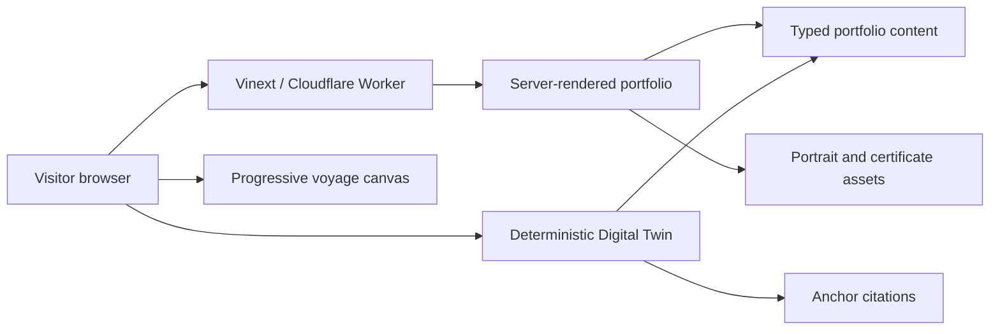
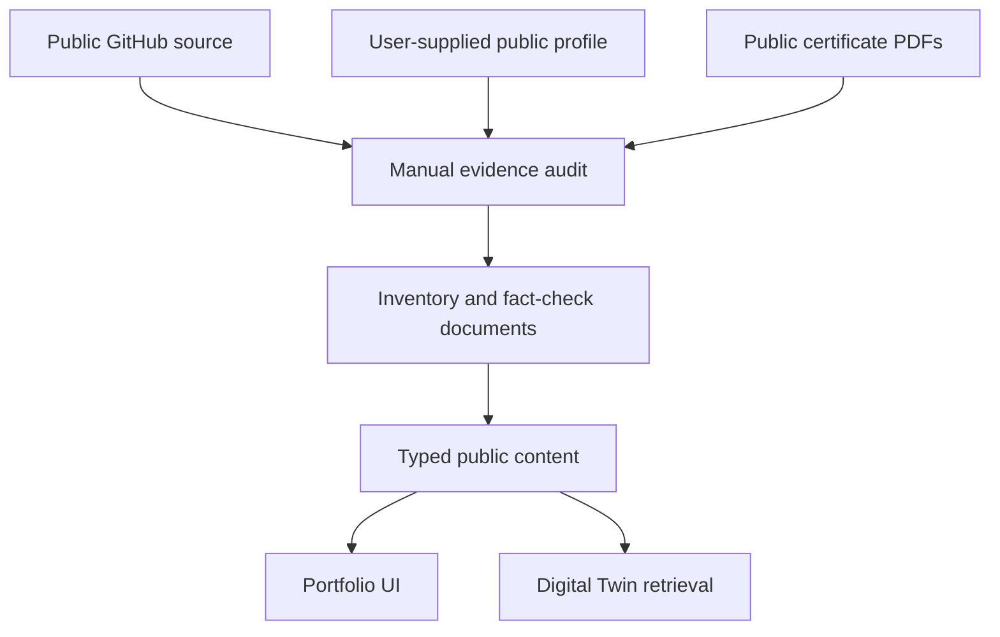
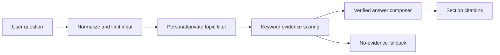
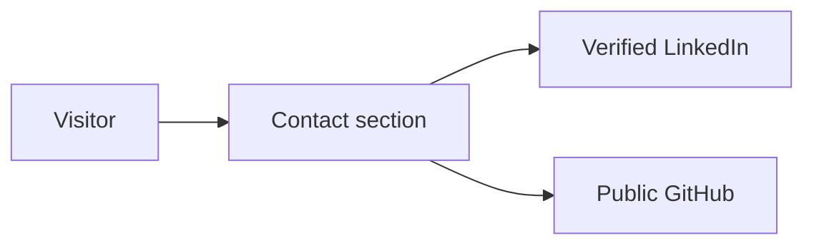
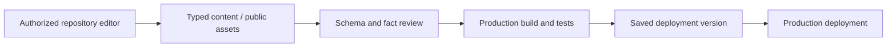
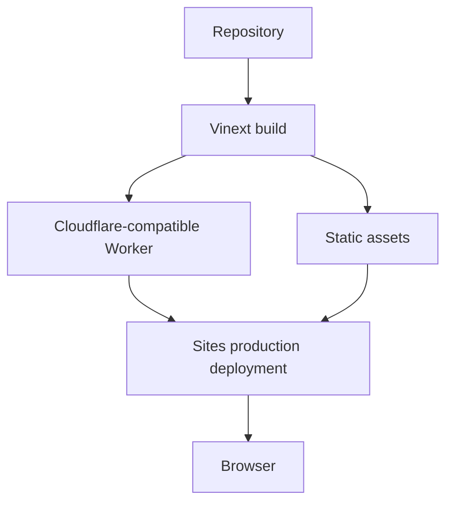

# System Architecture

## High-level architecture

The first production version is a static-first Next.js/TypeScript portfolio built with Vinext for Cloudflare-compatible output. Structured TypeScript content powers both the visual portfolio and deterministic Digital Twin. No database, authentication, external AI provider or contact-message storage is required.

## Frontend

- `app/page.tsx`: metadata, structured Person data and root page
- `app/components/PortfolioClient.tsx`: navigation, sections, filters and performance mode
- `app/components/VoyageScene.tsx`: optional canvas enhancement
- `app/components/DigitalTwin.tsx`: local deterministic retrieval
- `content/portfolio.ts`: public knowledge and case-study model
- `app/globals.css`: tokens, layout, motion and responsive behavior

## Backend

No application backend is required for current features. Static/server-rendered delivery reduces attack surface. Contact uses direct email, phone, LinkedIn and GitHub routes without storing visitor messages.

## Content ingestion

Content updates are repository-backed: update the typed content, update the corresponding audit record, run validation, and publish a new version.

## Digital Twin retrieval

The current Twin has no generative model, network request or persistent transcript. This is the guaranteed fallback architecture for any later optional Ollama or hosted adapter.

## Contact flow

No contact form is shipped until a secure, rate-limited delivery destination is configured.

## Admin update flow

There is no insecure client-only admin route. Repository access is the authorization boundary.

## Deployment topology

## Security boundaries

- Public browser bundle: approved portfolio content only
- Public assets: portrait and explicitly public certificate PDFs
- Build environment: no company documents or credentials
- External destinations: GitHub, LinkedIn and selected public project demos
- No client secrets, database, upload route or private admin session

## Failure modes

- JavaScript disabled: core portfolio HTML and external links remain available
- WebGL/canvas unavailable: all project/navigation content remains semantic HTML
- Reduced motion: Minimal mode disables continuous visual movement
- Missing external demo: repository evidence remains available
- Digital Twin no match: explicit no-source answer with suggested topics
- Missing résumé or public showcase URL: unsupported controls are omitted while repository evidence remains available

## Performance strategy

- No 3D or animation package
- Canvas uses a capped device pixel ratio and small deterministic star set
- Essential content server-renders
- Original portrait is 316 KB and cropped through CSS
- PDF assets are only downloaded when opened
- Full/Balanced/Minimal modes and reduced-motion support
- No continuous render in Minimal mode
